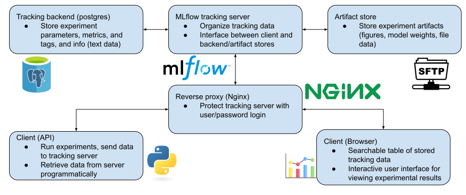

# mlflow-server-docker
Minimal, fully-containerized mlflow server with remote postgres tracking db and sftp artifact store.



# High-throughput, portable, reproducible, and organized experiments

Computational researchers, especially in non-cs disciplines, are often expected to write large volumes of code without being taught good development practices. As a result, lots of academic code is messy and buggy, and researchers often "reinvent the wheel" instead of using published code. This project provides a simple, working example of **MLflow** deployed with **docker** for facilitating experiments, with the goal of making these tools easier to adopt by new users.

## MLflow
[MLflow](https://mlflow.org/) is a general-purpose MLOps tool. For academic research the main benefit it provides is experiment tracking. When running experiments, you can save input and output values, (learning rate, validation loss, etc) and "artifacts" (figures, saved models, etc). MLflow organizes all of these into a searchable database and provides browser-based and api-based methods for viewing the results. No more forgetting where that figure you need is, or having to combine 20 different spreadsheets to get a complete set of results. MLalow handles all of that for you.

MLflow also provides "projects", which allow for easy packaging and sharing computational code. Although very simple to configure, structuring experiments as mlflow projects makes it much easier for scaling up experiments and allows new users to figure out how to reproduce results.

## Docker
In this project, mlflow tracking and experiments are deployed with [Docker](https://www.docker.com/), a container engine. *Containers* behave like lightweight virtual machines, providing consistent and isolated runtimes for the tracking server and experiments. By packaging components into containers, Docker is the *only* dependency needed to run the tracking server. In this project, mlflow uses PostgreSQL to store tracking data and SFTP
to store *artifacts*. However, you don't need to install and configure these tools to use with mlflow. They are already included in the containers used to run the mlflow tracking server. Thus, using containers provides an easy and robust way to use software tools that would otherwise be difficult or time consuming to configure manually.

# Installation
## Install docker
The only dependency for the server is Docker. Follow the [instructions](https://docs.docker.com/engine/install/) from docker
to install it on your system. Since docker runs as root, you will likely need to
run docker commands with **sudo** after installation. To run docker without sudo,
you can add your user to the docker group:

```bash
$ sudo groupadd docker
$ sudo usermod -aG docker $USER
```
After logging out and logging back in, you should be able to run docker commands without sudo.

Note that older installations of docker may not include docker compose, which is used for running the server from a configuration file. If you don't already have compose, update your installation of docker to a recent version.
  
## Run the server

With docker installed, the server will work out of the box. Simply run:
```bash
$ # run without optional -d argument to view container status in terminal
$ docker compose up -d
```
Now you are ready to start running experiments!
## Adjust server configuration
The server will work out of the box, but if desired you can adjust the configuration with your own values. Variable definitions, including the port that the mlflow server runs on and the ssh key used to connect to artifact storage, are are specified in **.env**. To use new values, simply change the definitions in this file.

The configuration of the containers is specified in **docker-compose.yaml**
To change the images used for each component, commands executed upon startup,
and other settings, you can update this file.

# Start tracking!
With the server running, you are ready to start tracking experiments!

## Tracking with regular python files
Minimal code is needed to start saving results to the mlflow server. The
tracking commands can be inserted into existing code, minimizing the cost of adopting mlflow.
A minimal example shows only 3 lines of code are needed to track a value:
```python
>>> import mlflow
>>> # tell mlflow where to save results to. assumes the server runs on port 5000
>>> mlflow.set_tracking_uri("http://localhost:5000")
>>> mlflow.log_param("learning_rate", 0.001) # logs a value to the tracking server
```

## Tracking with mlflow projects
Mlflow also provides a method for packaging code into portable, reproducible collections
called **projects**. Some simple example mlflow projects, including instructions
for running and tracking them, are provided in the **example-mlflow-projects/** directory.

# Accessing the results

## Browser
Open your favorite browser and go to **http://localhost:5000** (unless you changed MLFLOW_SERVER_PORT in .env to a different value 5000).
You will be prompted to enter a username and password. The default credentials are "user" and "password", respectively, and can be changed
by changing the MLFLOW_TRACKING_USERNAME and MLFLOW_TRACKING_PASSWORD variables in `.env`. After logging in,
You should see a table of run tracking data. Click on a run to view more details, including 
the saved models, interactive figures, and more.

## Python
You can also access run results programatically in Python.
```python
>>> import mlflow
>>> mlflow.set_tracking_uri("http://localhost:5000")
>>> # get unique identifier of experiment with name "Default"
>>> exp_id = mlflow.get_experiment_by_name('Default').experiment_id
>>> # get a pandas dataframe of all runs included in the default experiment
>>> df = mlflow.search_runs([exp_id,])
```

# Need help?
Feel free to submit questions and requests to the [issue tracker](https://github.com/rccohn/mlflow-server-docker/issues).
